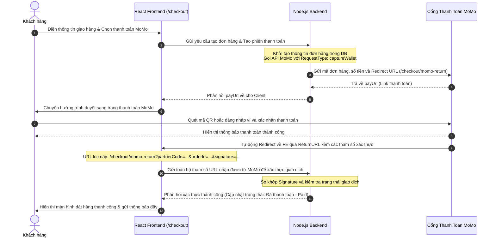

# TÀI LIỆU CHI TIẾT VÀ BẢN ĐỒ CƠ CHẾ HOẠT ĐỘNG TOÀN DIỆN
## DỰ ÁN: CLOTHES STORE - FRONTEND (rinstore-web)

Tài liệu này cung cấp một bản phân tích chuyên sâu nhất về mã nguồn, cấu trúc thư mục, kiến trúc phân tầng, cơ chế luồng công việc kỹ thuật (Technical Workflows), và tích hợp API bên ngoài của hệ thống **Clothes Store (Frontend)**.

---

## MỤC LỤC
1. **Kiến Trúc Tổng Quan & Stack Công Nghệ**
2. **Bản Đồ Thư Mục & Vai Trò Các Tệp Tin**
3. **Phân Tích Chi Tiết Các Phân Hệ & Chức Năng**
4. **Bản Đồ Luồng Hoạt Động (Detailed Technical Flows)**
5. **Cơ Chế Vận Hành Lõi (Core Technical Mechanisms)**
6. **Tích Hợp Dịch Vụ Bên Ngoài (External Integrations)**
7. **Hướng Dẫn Cấu Hình, Khởi Chạy & Xử Lý Sự Cố**

---

## 1. KIẾN TRÚC TỔNG QUAN & STACK CÔNG NGHỆ

Hệ thống **Clothes Store (rinstore-web)** được kiến trúc theo mô hình **Single Page Application (SPA)** hiện đại, tập trung vào hiệu năng cao, giao diện mượt mà và tương tác thời gian thực.

### Công Nghệ Cốt Lõi:
*   **React 19 (TypeScript):** Thư viện dựng giao diện người dùng, sử dụng các hook nâng cao (`useCallback`, `useMemo`, `useRef`, `useContext`) để tối ưu hóa việc re-render.
*   **Vite:** Công cụ build thế hệ mới giúp tăng tốc độ HMR (Hot Module Replacement) khi phát triển và tối ưu bundle kích thước nhỏ khi build production.
*   **Tailwind CSS (v4):** Framework styling tiện ích cho phép thiết kế giao diện tối giản, hiện đại, thích ứng hoàn hảo với các kích thước màn hình (Responsive Design).
*   **Framer Motion:** Thư viện diễn hoạt (Animation) tạo hiệu ứng chuyển động mượt mà cho Stepper, Modal, và hiệu ứng AI Try-On.
*   **Redux Toolkit & React Context API:** Đóng vai trò quản lý trạng thái (State Management) đa tầng. Context dùng cho các trạng thái toàn cục gọn nhẹ (Auth, Cart, Language, Notifications, Toast) và Redux cho luồng dữ liệu phức tạp.

---

## 2. BẢN ĐỒ THƯ MỤC & VAI TRÒ CÁC TỆP TIN

Cấu trúc thư mục được chia nhỏ theo mô hình Component-Driven và API-Driven rõ ràng:

```
Clothes_Store_FE/
├── .env                  # Lưu trữ biến môi trường quan trọng (API URL, Token)
├── .env.example          # Tệp cấu hình mẫu cho môi trường phát triển
├── index.html            # Entry point HTML của ứng dụng (Nhúng Google Fonts)
├── vite.config.ts        # Cấu hình Vite bundler và Proxy cục bộ
├── tailwind.config.ts    # Cấu hình chủ đề (theme), màu sắc thương hiệu Tailwind
├── package.json          # Danh sách thư viện phụ thuộc và scripts chạy dự án
└── src/
    ├── main.tsx          # Điểm khởi tạo React App và bọc các Context Providers
    ├── apis/             # Tầng tích hợp API, giao tiếp với mạng (Network Layer)
    │   ├── axiosClient.ts   # Axios instance chung với interceptors đính kèm token
    │   ├── userApi.ts       # API xác thực, thông tin cá nhân
    │   ├── productApi.ts    # API lấy danh sách, chi tiết sản phẩm
    │   ├── orderApi.ts      # API quản lý và đặt hàng
    │   └── tryOnApi.ts      # API xử lý kết nối HuggingFace AI Try-On
    ├── contexts/         # Quản lý trạng thái chia sẻ (State Management)
    │   ├── AuthContext.tsx         # Quản lý phiên đăng nhập, thông tin người dùng
    │   ├── CartContext.tsx         # Quản lý giỏ hàng (thêm/sửa/xóa/lưu localStorage)
    │   ├── NotificationContext.tsx # Quản lý hệ thống thông báo đẩy thời gian thực
    │   ├── FavoritesContext.tsx    # Lưu trữ sản phẩm yêu thích của khách hàng
    │   ├── LanguageContext.tsx     # Đa ngôn ngữ hóa giao diện (VI/EN)
    │   └── ToastContext.tsx        # Quản lý thông báo Toast pop-up nhanh
    ├── hooks/            # Các Custom Hooks tái sử dụng
    │   └── useAuth.ts              # Rút trích nhanh dữ liệu Auth từ Context
    ├── routes/           # Định tuyến và phân quyền bảo mật
    │   └── AppRoutes.tsx           # Bản đồ định tuyến toàn ứng dụng & bảo vệ phân quyền
    ├── pages/            # Thành phần giao diện (UI) của từng trang cụ thể
    │   ├── Home/                   # Trang chủ ứng dụng
    │   ├── Shop/                   # Danh mục mua sắm sản phẩm
    │   ├── Product/                # Chi tiết sản phẩm & Đánh giá từ cộng đồng
    │   ├── Checkout/               # Checkout đơn hàng & Nhận kết quả từ MoMo
    │   ├── TryOn/                  # Trang thử đồ ảo AI 3 bước chuyên sâu
    │   ├── MyPage/                 # Trang cá nhân khách hàng & quản lý đơn hàng đã đặt
    │   └── Admin/                  # Phân hệ quản trị (Dashboard, Products, Orders, Users...)
    ├── components/       # Các UI Component dùng chung (Layout, Button, Form...)
    ├── styles/           # CSS toàn cục và các token phong cách
    ├── utils/            # Các hàm tiện ích bổ trợ (Định dạng giá, ngày tháng...)
    └── types/            # Định nghĩa các interface/types dữ liệu TypeScript
```

---

## 3. PHÂN TÍCH CHI TIẾT CÁC PHÂN HỆ & CHỨC NĂNG

### 3.1. Phân Hệ Khách Hàng (Customer Module)
*   **Khám phá sản phẩm:** Hệ thống lấy dữ liệu trực tiếp qua `productApi.getAll()` hoặc lấy sản phẩm theo danh mục/bộ sưu tập. Khi nhấn vào sản phẩm, hệ thống chuyển hướng đến `/product/:id` để đọc thông tin chi tiết được hiển thị trực quan.
*   **Giỏ hàng thông minh (`CartContext.tsx`):**
    *   Tự động tính toán tổng số tiền, thuế, phí giao hàng, và số lượng mặt hàng.
    *   Đồng bộ hóa dữ liệu với `localStorage` để giữ nguyên trạng thái giỏ hàng khi người dùng tải lại trang (reload) hoặc đóng trình duyệt.
*   **Đăng ký & Kích hoạt OTP:**
    *   Luồng đăng ký thu thập các trường thông tin từ người dùng và gửi qua `userApi.register(data)`.
    *   Tài khoản mới tạo sẽ ở trạng thái chờ kích hoạt. Trình duyệt tự động chuyển hướng khách hàng sang `/verify-account` yêu cầu nhập mã OTP được gửi về Email để kích hoạt tài khoản sử dụng.

### 3.2. Tính Năng Thử Đồ Ảo AI (Virtual Try-On - `/try-on`)
Chức năng này áp dụng kiến trúc giao diện **3-Step Stepper** kết hợp hoạt ảnh mượt mà:
*   **Bước 1: Chọn hoặc tải ảnh hình mẫu (Model Image):**
    *   *Chọn Avatar có sẵn:* Hệ thống cung cấp 4 avatar mẫu đại diện cho nam và nữ với phong cách Casual (thường ngày) hoặc Sporty (thể thao).
    *   *Tải ảnh cá nhân (Upload):* Hỗ trợ kéo thả (drag & drop) tệp ảnh chân dung. Hiển thị danh sách mẹo để AI xử lý tối ưu (chụp đủ toàn thân, đứng thẳng, tay dang nhẹ, ánh sáng tốt, nền trơn).
*   **Bước 2: Chọn trang phục thời trang cần thử (Outfit Image):**
    *   FE gọi API lấy toàn bộ sản phẩm của cửa hàng.
    *   **Bộ lọc An toàn AI (`isClothing`):** Nhằm tránh việc người dùng chọn nhầm phụ kiện (như túi xách, giày, nón, tất, móc khóa...) khiến mô hình AI bị lỗi hoặc ra ảnh biến dạng, FE lập trình một bộ lọc thông minh:
        *   *Chỉ cho phép:* Các sản phẩm thuộc danh mục áo thun, sơ mi, áo khoác, hoodie, áo len (`clothingKeywords`).
        *   *Loại bỏ:* Các từ khóa thuộc nhóm quần, váy, đầm, giày, dép, mũ, phụ kiện và quà tặng (`excludeKeywords`).
*   **Bước 3: Gửi xử lý AI & Hiển thị kết quả:**
    *   Hiển thị màn hình chờ đặc biệt ("AI Is Working Its Magic") với vòng tròn ping lấp lánh và bộ đếm thời gian trôi qua thực tế (Elapsed seconds).
    *   *Kết quả thành công:* Hiển thị hình ảnh kết quả đã ghép đồ. Cung cấp chức năng tải xuống tệp ảnh chất lượng cao (.png), nút thêm nhanh sản phẩm đang thử vào giỏ hàng (`handleAddToCart`), hoặc xem trang chi tiết.
    *   *Xử lý lỗi (ZeroGPU Quota Limit):* Nếu gặp lỗi do server HuggingFace quá tải hoặc chặn IP quá hạn mức miễn phí, FE sẽ mở rộng khối cấu hình **Bypass Quota**. Khách hàng có thể đăng nhập tài khoản Hugging Face, tạo Access Token cá nhân với quyền **Read** và dán vào ứng dụng. Token này được lưu trữ trực tiếp vào `localStorage` (`hf_token`) giúp tăng độ ưu tiên hàng đợi và bỏ qua giới hạn IP.

### 3.3. Phân Hệ Quản Trị Viên (Admin Module)
*   **Quản trị Sản phẩm & Danh mục:** Admin có thể thêm mới sản phẩm bằng cách tải ảnh lên, phân loại danh mục, gán bộ sưu tập, đặt mức giá bán lẻ và giá khuyến mãi.
*   **Quản lý Đơn hàng & Cập nhật Trạng thái:** Trang `/admin/orders` là trung tâm vận hành. Khi Admin nhấp chọn đổi trạng thái đơn hàng (ví dụ: chuyển từ *Pending* sang *Shipping* hoặc *Completed*), hệ thống sẽ gửi yêu cầu cập nhật lên Backend qua `orderApi.updateStatus`. Khi cập nhật thành công, Backend sẽ tự động phát tín hiệu thời gian thực đến khách hàng.

---

## 4. BẢN ĐỒ LUỒNG HOẠT ĐỘNG (DETAILED TECHNICAL FLOWS)

### 4.1. Luồng Thanh Toán Tích Hợp Ví Điện Tử MoMo



### 4.2. Luồng Xử Lý Lõi Tính Năng AI Try-On

```mermaid
flowchart TD
    A[Khách hàng nhấp nút TRY IT ON ở Bước 2] --> B[Chuyển đổi các hình ảnh đầu vào sang định dạng Blob]
    B --> B1{Ảnh dạng Base64?}
    B1 -- Đúng --> B2[Hàm base64ToBlob chuyển đổi thủ công bằng Uint8Array]
    B1 -- Sai --> B3[Hàm urlToBlob thực hiện fetch URL lấy dữ liệu thô nhị phân]
    
    B2 --> C[Tự động phân loại danh mục & sinh Prompt tối ưu]
    B3 --> C
    
    C --> C1{Sản phẩm là Đồ dưới / Váy?}
    C1 -- Bottoms/Quần/Shorts --> C2[Prompt: 'pants, lower_body, bottoms, [tên sản phẩm]']
    C1 -- Dresses/Váy liền/Đầm --> C3[Prompt: 'dresses, dress, one-piece, [tên sản phẩm]']
    C1 -- Tops/Áo thun/Áo khoác --> C4[Prompt: 'tops, upper_body, shirt, tshirt, hoodie, jacket, [tên sản phẩm]']
    
    C2 --> D[Kết nối Hugging Face Gradio Client]
    C3 --> D
    C4 --> D
    
    D --> D1[Lấy mã VITE_HF_TOKEN hoặc hf_token từ localStorage]
    D1 --> D2[Client.connect 'yisol/IDM-VTON' kèm token xác thực]
    
    D2 --> E[Gọi hàm dự đoán client.predict '/tryon']
    E --> E1[Truyền các thông số: dict background, garm_img, garment_des, denoise_steps=30, seed=42]
    
    E1 --> F{Xử lý thành công?}
    F -- Lỗi Quota/Server busy --> G[Hiển thị thông báo lỗi & mở cổng cấu hình Access Token để Bypass Quota]
    F -- Thành công --> H[Duyệt mảng kết quả trả về từ Gradio]
    H --> H1[Trích xuất đường dẫn ảnh hoàn chỉnh slot.url hoặc slot.path]
    H1 --> I[Hiển thị ảnh kết quả lên giao diện cho Khách hàng]
```

---

## 5. CƠ CHẾ VẬN HÀNH LÕI (CORE TECHNICAL MECHANISMS)

### 5.1. Cơ Chế Đồng Bộ Thông Báo Thời Gian Thực Kép (Hybrid Real-time Notifications)
Hệ thống thông báo đẩy (`NotificationContext.tsx`) được thiết kế cực kỳ bền bỉ nhờ sự phối hợp của hai cơ chế hoạt động độc lập nhằm hỗ trợ lẫn nhau:

```
                  ┌─────────────────────────────────────┐
                  │ Khách hàng đăng nhập / Mở ứng dụng   │
                  └──────────────────┬──────────────────┘
                                     │
                     ┌───────────────┴───────────────┐
                     ▼                               ▼
       [ Cơ chế 1: Socket.io ]              [ Cơ chế 2: DB Polling Fallback ]
   ┌───────────────────────────┐         ┌─────────────────────────────────────┐
   │ Thiết lập kết nối Socket  │         │ Chạy định kỳ sau mỗi 7 giây         │
   └─────────────┬─────────────┘         └──────────────────┬──────────────────┘
                 │                                          │
                 ├─► Khách hàng: Join Room `user_[id]`      ├─► Khách hàng: Lấy danh sách đơn hàng
                 │                                          │   bằng `getOrdersByUserId(id)`
                 └─► Admin: Join Room `admin`               │
                                                            ├─► So sánh trạng thái đơn hàng cũ 
    Lắng nghe sự kiện tức thời:                             │   trong localStorage để phát hiện thay đổi
    - Admin: `new_order`                                    │
    - Khách hàng: `order_status_updated`                    ├─► Kiểm tra ID đơn hàng để tránh
                 │                                          │   phát thông báo trùng lặp
                 ▼                                          ▼
   ┌───────────────────────────────────────────────────────────────────────────┐
   │                 Hiển thị thông báo đẩy lên màn hình người dùng             │
   └─────────────────────────────────────┬─────────────────────────────────────┘
                                         │
                                         ▼
   ┌───────────────────────────────────────────────────────────────────────────┐
   │ Tự động đồng bộ sang tất cả các Tab trình duyệt khác bằng sự kiện 'storage' │
   └───────────────────────────────────────────────────────────────────────────┘
```

1.  **Cơ chế WebSockets (Socket.io-client):**
    *   Tự động trích xuất địa chỉ máy chủ từ cấu hình biến môi trường và thiết lập kênh truyền dữ liệu hai chiều.
    *   Khi kết nối thành công, hệ thống xác định vai trò:
        *   Nếu là *Khách hàng*, gửi yêu cầu tham gia phòng riêng biệt: `socket.emit('join_room', 'user_<user_id>')`.
        *   Nếu là *Quản trị viên (Admin)*, tham gia phòng quản trị: `socket.emit('join_room', 'admin')`.
    *   Lắng nghe trực tiếp các sự kiện đẩy từ máy chủ: sự kiện đơn hàng mới (`new_order`) cho quản trị và thay đổi trạng thái đơn hàng (`order_status_updated`) cho khách hàng.
2.  **Cơ chế Dự Phòng (Database Polling Fallback):**
    *   Khi kết nối mạng chập chờn hoặc máy chủ Socket gặp sự cố, hệ thống kích hoạt bộ hẹn giờ ngầm chu kỳ **7 giây**.
    *   Mỗi chu kỳ, hệ thống gọi API để lấy trạng thái đơn hàng mới nhất từ database.
    *   Để tránh việc hiển thị lại các thông báo cũ gây phiền toái, hệ thống lưu trữ trạng thái đơn hàng đã đọc vào `localStorage` (`t1_notified_orders_admin` và `t1_order_statuses_<userId>`). Chỉ khi phát hiện sự thay đổi về trạng thái (ví dụ trạng thái chuyển từ *Shipping* sang *Completed*), hệ thống mới phát thông báo mới.
3.  **Đồng bộ đa tab (Cross-Tab Synchronization):**
    *   Nhờ lắng nghe sự kiện thay đổi bộ nhớ trình duyệt `window.addEventListener('storage', handleStorageChange)`, khi người dùng nhấn "Đánh dấu đã đọc" hoặc xóa thông báo trên tab này, tất cả các tab khác đang mở của trang web sẽ ngay lập tức cập nhật giao diện đồng bộ.
4.  **Cơ chế Chuyển đổi Giao diện (Theme Switching) bằng Factory Method Pattern:**
    *   Để thực thi yêu cầu chuyển đổi giao diện giữa **Dark Mode (Giao diện tối)** và **Light Mode (Giao diện sáng)** của phân hệ Admin một cách chuyên nghiệp và có tính mở rộng cao, dự án áp dụng mẫu thiết kế **Factory Method Pattern**:
        *   **Product Interface (`ThemeProduct`):** Định nghĩa các đặc tả phong cách cần thiết của một giao diện (màu nền, màu sidebar, màu chữ chính, màu chữ mờ, màu đường viền, nút active, nút inactive, thẻ card...).
        *   **Concrete Products (`LightThemeProduct`, `DarkThemeProduct`):** Hiện thực cụ thể các giá trị lớp CSS Utility tương thích của Tailwind v4 cho từng chủ đề giao diện tương ứng.
        *   **Creator Abstract Class (`ThemeCreator`):** Khai báo Factory Method (`createTheme()`) trả về một đối tượng giao diện `ThemeProduct`.
        *   **Concrete Creators (`LightThemeCreator`, `DarkThemeCreator`):** Ghi đè phương thức tạo để khởi tạo chính xác đối tượng sản phẩm Light hoặc Dark Theme tương ứng.
        *   **Selector (`ThemeFactorySelector`):** Đóng vai trò Client Helper, tự động phân phối đúng Creator dựa trên tùy chọn người dùng.
        *   **Tích hợp React Context (`AdminThemeContext.tsx`):** Quản lý trạng thái giao diện ở mức toàn cục phân hệ Admin, lưu lựa chọn vào `localStorage` và cấp phát thực thể `ThemeProduct` nhận được từ Factory Method sang `AdminLayout.tsx` và các trang con (như `AdminDashboard.tsx`) để tự động thay đổi lớp CSS.

---

## 6. TÍCH HỢP DỊCH VỤ BÊN NGOÀI (EXTERNAL INTEGRATIONS)

| Dịch vụ tích hợp | Thư viện & Phương thức kết nối | Mô tả luồng dữ liệu & Nghiệp vụ |
| :--- | :--- | :--- |
| **Hugging Face Spaces**<br>(Mô hình IDM-VTON) | Thư viện kết nối `@gradio/client` và hàm trợ giúp `handle_file` để upload ảnh. | FE kết nối và truyền ảnh nền (avatar khách hàng), ảnh quần áo thời trang, câu lệnh prompt phân loại danh mục, và các tham số kỹ thuật (`denoise_steps=30`, `seed=42`, `auto-masking=true`). Server xử lý bằng GPU và trả về URL ảnh kết quả. |
| **Ví Điện Tử MoMo** | API Redirect URL tích hợp từ Backend. FE xử lý kết quả thông qua route `/checkout/momo-return`. | Khi người dùng thực hiện thanh toán xong trên ứng dụng hoặc trang chủ MoMo, hệ thống của MoMo tự động chuyển hướng khách hàng quay trở lại giao diện web kèm theo các tham số ký số để FE chuyển tiếp lên BE xác thực và cập nhật trạng thái đơn hàng. |
| **Socket.io Server** | Thư viện `socket.io-client` thiết lập kết nối truyền dữ liệu thời gian thực. | Nhận sự kiện trực tiếp từ Backend để hiển thị thông báo đẩy lên UI tức thì cho người dùng khi có đơn hàng mới hoặc có thay đổi về trạng thái vận chuyển của đơn hàng. |
| **Google Fonts API** | Thẻ `<link>` trong tệp tin `index.html`. | Nhúng các phông chữ hiện đại gồm: *Roboto* (chữ nội dung thông thường), *Macondo*, *VT323*, *Momo Signature* và *Rubik Bubbles* (phục vụ hiển thị tiêu đề và trang trí thẩm mỹ). |
| **Hệ thống Icon SVG** | Thư viện npm `lucide-react` và `bootstrap-icons`. | Cung cấp các icon vector hiển thị sắc nét, nhẹ, và đồng bộ phong cách thiết kế hiện đại của giao diện. |

---

## 7. HƯỚNG DẪN CẤU HÌNH, KHỞI CHẠY & XỬ LÝ SỰ CỐ

### 7.1. Hướng dẫn Khởi Chạy Nhanh (Quick Start)
1.  **Cài đặt các thư viện liên quan:**
    ```bash
    npm install
    # hoặc
    yarn install
    ```
2.  **Cấu hình tệp tin `.env` ở thư mục gốc:**
    ```env
    VITE_API_URL=http://localhost:3000/api/v1
    VITE_HF_TOKEN=hf_your_access_token_here
    ```
3.  **Khởi chạy dự án ở môi trường cục bộ (Local Development):**
    ```bash
    npm run dev
    # hoặc
    yarn dev
    ```
    *Ứng dụng mặc định sẽ được chạy tại cổng kết nối:* `http://localhost:5173`.

4.  **Kiểm tra và sửa lỗi cú pháp (Linting):**
    ```bash
    npm run lint
    ```

5.  **Biên dịch mã nguồn đóng gói dự án (Production Build):**
    ```bash
    npm run build
    ```

### 7.2. Xử lý một số sự cố thường gặp (Troubleshooting)
*   **Lỗi AI Try-On không phản hồi hoặc trả về thông tin rỗng:**
    *   *Nguyên nhân:* Server HuggingFace miễn phí bị quá tải hoặc IP cục bộ bị khóa do vượt quá hạn mức lượt gọi.
    *   *Giải pháp:* Đăng ký tài khoản HuggingFace miễn phí, tạo Access Token với quyền **Read** tại trang quản trị tài khoản cá nhân, dán mã token này vào khung cấu hình **Bypass Quota** ngay trên giao diện Try-On của ứng dụng để bỏ qua giới hạn IP.
*   **Không nhận được thông báo đẩy khi thay đổi trạng thái đơn hàng:**
    *   *Nguyên nhân:* Kết nối Socket.io bị chặn bởi tường lửa hoặc backend server chưa được bật.
    *   *Giải pháp:* Hệ thống sẽ tự động chuyển sang chế độ quét dữ liệu ngầm (DB Polling) sau mỗi 7 giây để đảm bảo thông báo vẫn hiển thị đầy đủ. Hãy kiểm tra lại kết nối mạng hoặc xem tab Console của trình duyệt để kiểm tra trạng thái kết nối Socket.
*   **Lỗi CORS khi gọi API:**
    *   *Nguyên nhân:* Địa chỉ cổng Backend cấu hình trong tệp `.env` không trùng khớp với địa chỉ chạy thực tế của Server.
    *   *Giải pháp:* Cấu hình chính xác đường dẫn cổng Backend tại `VITE_API_URL`. Nếu chạy cục bộ, kiểm tra xem Vite Config đã bật proxy chuyển tiếp phù hợp hay chưa.
